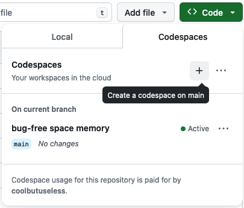
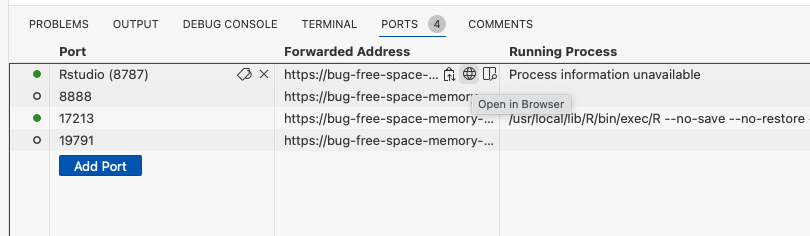

<!-- README.md is generated from README.Rmd. Please edit that file -->

```{r, include = FALSE}
knitr::opts_chunk$set(
  collapse = TRUE,
  comment = "#>",
  fig.path = "man/figures/README-",
  out.width = "100%"
)

library(codespacer)
```

# codespacer

<!-- badges: start -->

<!-- badges: end -->

`{codespacer}` will install the necessary files to support Github Codespaces 
running an RStudio session.

This package is mostly just an aide-memoire for me - especially if I need to setup
a rstudio codespace in a hurry.

## Installation

You can install from [GitHub](https://github.com/coolbutuseless/codespacer) with:

``` r
# install.package('remotes')
remotes::install_github('coolbutuseless/codespacer')
```

## Install codespaces files in your package


```{r example, eval = FALSE}
# setwd(root-directory-of-your-package)
library(codespacer)
install_codespace_files()
# git add .devcontainer
# git commit -m "add codespace files" .devcontainer
# git push
```


## Launch a codespace in this repository

* Go the package repository on github
* `Code` -> `Codespaces` -> `Create a new codespace on main`
    * See Screenshot 1 below
* Wait for machine to build and start (first startup is slow. subsequent startups are faster)
* Select `ports` -> `Rstudio 8787` -> `Open in browser`
    * See Screenshot 2 below
* Login to Rstudio:  user = `rstudio`, pass = `rstudio`





## Links

* James Goldie's [Dev containers with R and Quarto](https://jamesgoldie.dev/writing/dev-containers-in-r/)
* David Smith's [Zero-setup R workshops with GitHub Codespaces](https://github.com/revodavid/devcontainers-rstudio)


## Acknowledgements

* R Core for developing and maintaining the language.
* CRAN maintainers, for patiently shepherding packages onto CRAN and maintaining
  the repository
